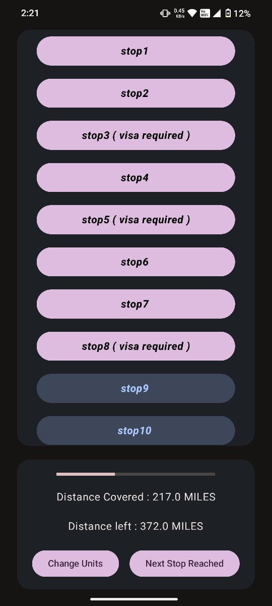

# Journey Tracker

## Overview
This is an androud application designed to track the jouney by showing details like current stop name, total distance covered till point, distance to be covered to reach the destination and a progress bar for visual interpretation. The app reads the jouney details by parsing a text file which is a resource, then creates data objects, which will be used to display the details in the UI

## UI Definition
The apps UI was defined using 2 approaches
### 1. JetPack Compose
* This allows to define the UI elements in the a single kotlin files that can also acoomodate the logic code.
* UI elements are kotlin functions with '@Composable' annotation. This declares that the functions is supposed to define the UI.
* These composables can take parameters like 'modifier' that helps in styling the UI components/Composables.

### 2. XML based Approach
* In this case the UI elements are defined in a layout.xml file.
* This XML file contains the elements in a nested fashion that declares the hiearchy of the componenets.
* To define the logic that should be associated to these elements, they should be referenced in the Main_Activity.kt and then these references are used to link the logic code to the UI elements.

## Objectives
* To display the progress of the journey using a Progress bar. LinearProgressIndicator composabe is used in case of compose version and  'ProgressBar' view is used in case of xml version

* To display the stops in a lazy fashion if the number of stops is greater than certain limit. 'LazyColum' compoable is used in case of compose version and 'RecyclerView' is used in case of xml version of the app

* To display buttons to change the units of distance and to mention that the next stop is reached. 'Button' composable with necessary function passed as the onClick parameter is used in the compose version and 'ButtonView' view with associated click event listeners are used in the xml version of the app.

* The details of the journey such as list of stops, distance coverd till point and distance to be covered till destination is displayed using, 'Text' composables in the compose version and 'TextView' in the xml version of the app

## UI sample

